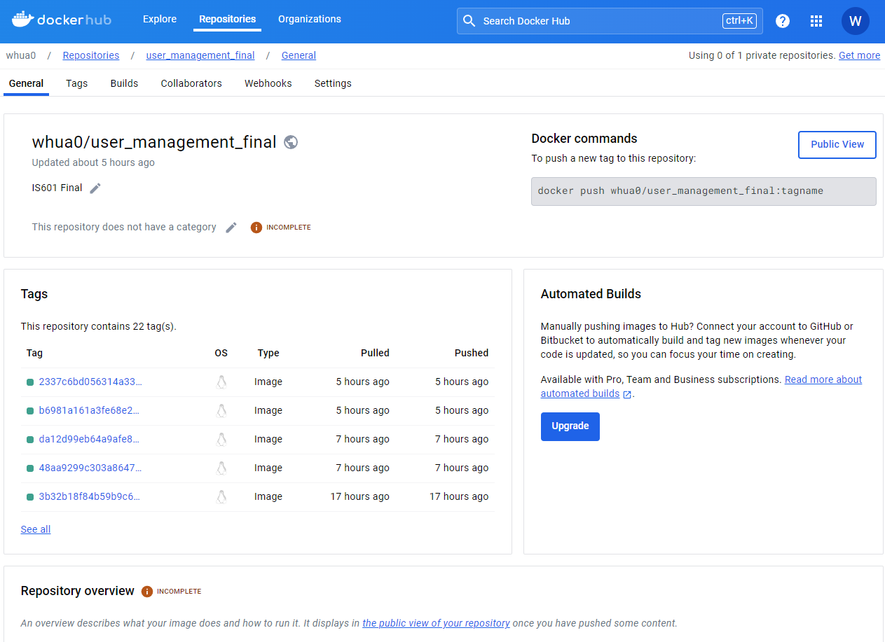

# IS601 Final: User Management

## Learnings & Experiences

## [Dockerhub](https://hub.docker.com/repository/docker/whua0/user_management_final/general)

## [Github Actions](https://github.com/WHua0/user_management_final/actions)

## [Github Commit History](https://github.com/WHua0/user_management_final/commits)

## Pytest Coverage

## [QA (Quality Assurance) Issues](https://github.com/WHua0/user_management_final/issues?q=is%3Aissue+is%3Aclosed)

### [Issue 1: POST / register / Register - New User Email Verification](https://github.com/WHua0/user_management_final/issues/1)

A verification email should be sent not before, but after the new user has been commited to the database. Thus, the code was rearranged accordingly.

Clicking the email verification link should only update user role to Authenticated if user role is Anonymous. It should not affect user roles, such as Authenticated, Manager, and Admin. Thus, an if statement was added.

### [Issue 2: POST / register / Register - Nonmatching Response Body](https://github.com/WHua0/user_management_final/issues/3)

User role input has no impact, and is automatically set to Anonymous. Thus, role was removed from UserBase. 

The code did not check for existing user with the same nickname in the database, and generated a random nickname regardless of input.

A database check for an existing user with the same nickname was added to the database check for an existing user with the same email. Logging error was also updated to "User with given email or nickname already exists".

HTTP 400 detail message was updated to "Email or Nickname already exists".

An if statement was added to generate nickname, such that a new nickname would be generated and used only if no nickname is provided. 

### [Issue 3: POST / users / Create User - Nonmatching Response Body & Missing Error for Diplicate Nickname](https://github.com/WHua0/user_management_final/issues/5)

The code was found to return the incorrect values for is_professional, linkedin_profile_url, and github_profile url.

The missing lines for is_professional, linkedin_profile_url, and github_profile url.was added to UserResponse.model_construct.

The code did not check if existing user with the same nickname already exists in the database. 

A nickname check was added to raise Http 400 if nickname was used by another user.

The email check was updated to reflect user with existing email, rather than just existing user, for clarity. 

### [Issue 4: GET / users / {user_Id} Get User - Nonmatching Response Body](https://github.com/WHua0/user_management_final/issues/7)

The code was found to return the incorrect value for is_professional.

The missing line for is_professional was added to UserResponse.model_construct.

### [Issue 5: PUT / users / {user_id} Update User - Nonmatching Response Body & Missing Error for Duplicate Email and Nickname](https://github.com/WHua0/user_management_final/issues/9)

The code was found to return the incorrect value for is_professional.

The missing line for is_professional was added to UserResponse.model_construct.

The code did not check if existing user with the same email or nickname already exists in the database. Furthermore, the check for if the user exists was incorrect, and in the wrong location. The checks should be before the updated data is committed to the database.

The check for if the user exists was updated to search the database for a matching user id, and raise Http 400 if not found.

The checks for a existing email and nickname were also added. However, the checks would only be performed if the user's updated nickname or email does not match the user's current ones. The checks raise Http 400 if nickname or email is already in use by another user.

### [Issue 6: GET / users / List User - Missing Error for Invalid Skip Integer and Limit Integer Input](https://github.com/WHua0/user_management_final/issues/10)

The code does not check the inputs for Skip Integer and Limit Integer. The only error returned is if Limit Integer is 0.

Two if statements was added to list users. If Skip Integer is less than 0, Http 400 is raised. If Limit Integer is not more than 0, Http 400 is raised.

### [Issue 7: Missing Validators, Max Length, Min Length, etc.](https://github.com/WHua0/user_management_final/issues/15)

The code did not check the inputs for many fields, such that edge cases were allowed. For instance, one could register an user with a password of an empty string.

Various validators and constraints, such as minimum length, maximum length, required characters, and invalid characters, were added to each field, enhancing security and preventing edge cases from occuring.

## New Feature Implementation

### User Profile Management: PUT / update-profile / Update Profile

FastAPI endpoint that allows current (logged in) user to update his/her profile fields: email, nickname, first_name, last_name, bio, profile_picture url, linkedin_profile_url, and github_profile_url. However, if user updates to a different email, an updated login token is required. User will need to re-log in to obtain an update login token to use this feature.

1. Added and Tested UserProfileUpdate(UserBase) in user_schemas.py. The schema is based on UserUpdate(UserBase), but without the option to update role.

2. The login token is created from user email, not user ID. Method get_current_user in dependencies.py was updated, changing user_id to user_email. This does not affect the method's function, but clears up misunderstanding that get_current_user returns user email, not user id, from the parameter login token.

3. Added and Tested @router.put("/update-profile/" ...) in user_routes.py. This is based on @router.put("/users/{user_id}" ...).
   1. Only users with the role of ADMIN, MANAGER, or AUTHENTICATED has access.
   2. Current user email is retrieved from the login token.
   3. If current user email is not found in the database, Http 404 is raised; this may occur if user changes his/her email, in which case a new login token is needed.
   4. If nickname update is already used by another user, Http 400 is raised.
   5. If email update is already used by another user, Http 400 is raised.
   6. The updates are commited to the database.
   7. UserResponse.model_construct is returned to the current user.

### User Profile Management: TBD